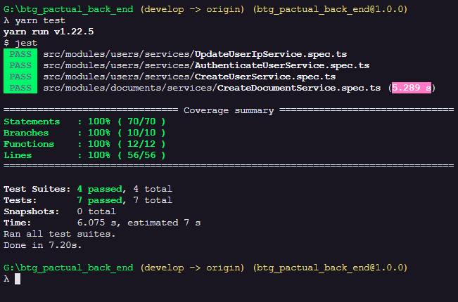

# BTG Pactual Back End Documentation

> Chanllenge:
>
> Desenvolva um serviço web REST onde conterá 2 funcionalidades:
>
> 1. Endpoint para autenticação do serviço;
>    * Login pode ser feito em memoria;
> 2. Endpoint para geração do documento com os dados inputados pelo usuário e salvar no disco
>    * Dados: Nome Completo, Data de Nascimento, CPF, RG;
>    * Documento pode ser um arquivo formato .txt com os dados escritos no seguinte formato:
>
>      Ex: Nome Completo: $Nome Data de Nascimento: $Data CPF: $CPF RG: $RG
>
>      Usuario Autenticado Login: $Login IP: $IP
>
>  **Pontos**
>
> * Autenticação poderá ser feita a escolha do entrevistado \(recomendamos o uso de JWT\);
> * Verificar se o usuário tem uma sessão valida para gerar o documento;
> * Inclusão de testes unitários e importante;
>
> Submeta o projeto ao github ou gitlab e nos envie o repositório para avaliarmos.

## Solution:

1. was implemented one route to create a new user, and then will be save at database. The database used on this project was SQLITE with TypeORM to be able has scalability. The user need pass login and password on body with JSON structure to create access.
2. the user will be can create a new session passing the login and password over JSON structure on body with post type.
3.   After all the user can create a new document. Them will be save on database and a new text file.

## Architecture, Technologies and Patterns.

This project was thought to grow health to fulfill new requirements. If need change any third-party the system already ready to be changed.

### The architecture:

* The back-end is ready to be exported to a any version of JavaScript. Was used TypeScript and React to resolve the scarcity of developers with knowledge of leged versions.
* The persistence of data are ready to grow up or be change. Today we use Sqlite DB, but it's ready to accept \(MySQL / MariaDB / Postgres / CockroachDB / SQLite / Microsoft SQL Server / Oracle / SAP Hana / sql.js\). Or NOSQL MongoDB.

### S.O.L.I.D principles / DDD and TDD.

I applied the DDD \(Domain-Driven Design\), segmented through knowledge area \(module/archive\). Only to back-end.

I don't applied every concept of methodology. Every project has different features, and different moments.

I isolate the archiver through the domain knowledge area. We has the ISSUE module with two entities \(Repository and Issue\). Why? Well we don't need more than one module don't have any sense have \(issue\) without \(repository\). thinkhing throug this way i decided make then in one module.

Separate the business rule from the INFRA layer. which are the tools chosen to interact with the business rule layer. Ready to be changed. If necessary. We need to ensure that it works with another library, thinking about that we have created generic repositories that can be linked to any library of this type.

Dependency Inversion Principle: instead of my repository know what the repository format are dealing. We pass this responsibility to the routes. Applying the interface and ensuring the L of solid. Basicly.

### Libraries:

* Dotenv: Loads environment variables from .env file.
* Express: Fast, unopinionated, minimalist web framework. REST.
* Reflect-metadata: Polyfill for Metadata Reflection API.
* Tsyringe: Lightweight dependency injection container for JavaScript/TypeScript.
* Typeorm: Data-Mapper ORM for TypeScript, ES7, ES6, ES5. Supports MySQL, PostgreSQL, MariaDB, SQLite, MS SQL Server, Oracle, MongoDB databases.
* Uuid: RFC4122 \(v1, v4, and v5\) UUIDs.
* bcryptjs: Cryptography library.
* class-transformer: Proper decorator-based transformation / serialization / deserialization of plain javascript objects to class constructors.
* jsonwebtoken: JSON Web Token implementation \(symmetric and asymmetric\).
* multer: Middleware for handling `multipart/form-data`.
* request-ip: A small node.js module to retrieve the request's IP address
* sqlite3: Asynchronous, non-blocking SQLite3 bindings
* swagger-ui-express: Swagger UI Express

## Getting Start

1. You should be have the LTS version of the node.
   1. [https://nodejs.org/en/](https://nodejs.org/en/)
      1. Ex: 12.18.3 LTS
2. After the node js install, you should be install the yarn Package Manager
   1. npm install -g yarn
3. **You need clone the back end project:**
   1. [https://github.com/Fernandoaml/btg\_pactual\_back\_end.git](https://github.com/Fernandoaml/btg_pactual_back_end.git)
   2. Go to the folder and on command line interface you must be run this command: **yarn**
4. **After run: yarn typeorm migration:run** 
5. **After run: yarn dev:server**

**\*\*Obs:** To this project i don't implemented the .env file with the secret hash to generate JWT token to make more easy to test.

## **Tests:**

* **Back End:**
  * To this project has only the Back-end test with JEST to make the TDD aplying unity tests
  * If you're with command line opened, you must open a new interface of command line in the same folder and run the next command.
    * **yarn test**

* **To see the coverage report \(Lcov-report\) you need to open the following file**:
  * \btg\_pactual\_back\_end\coverage\lcov-report\index.html

##  API - Swagger UI 

‌

* after of initialization of back-end. You will can access the Swagger page, to see the description of the API REST of LabQuality. The page as exemplification, as shown in the image below.

  * ​[http://localhost:3333/swagger/](http://localhost:3333/swagger/)

